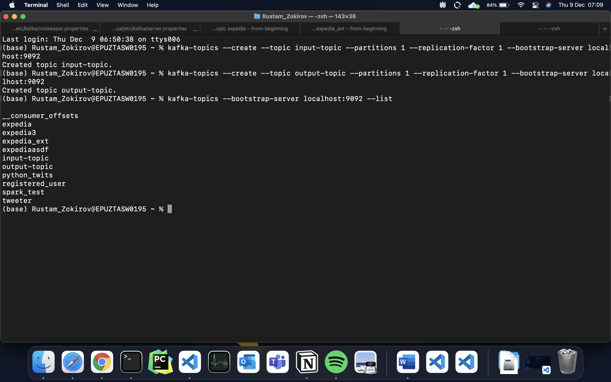
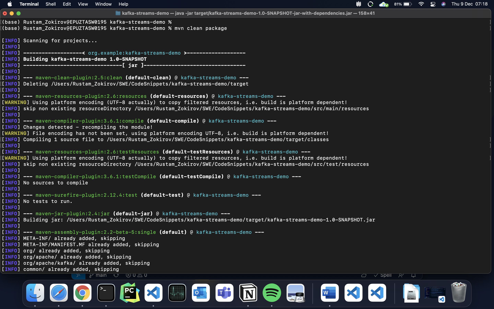
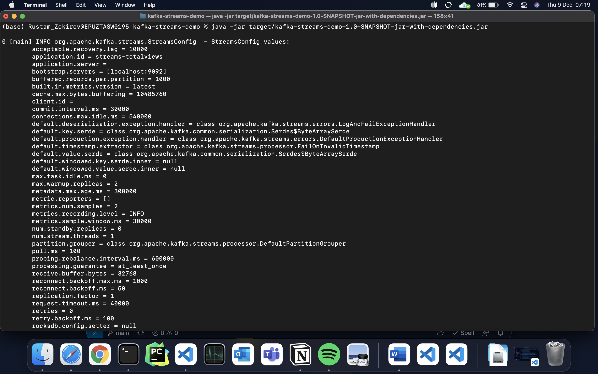
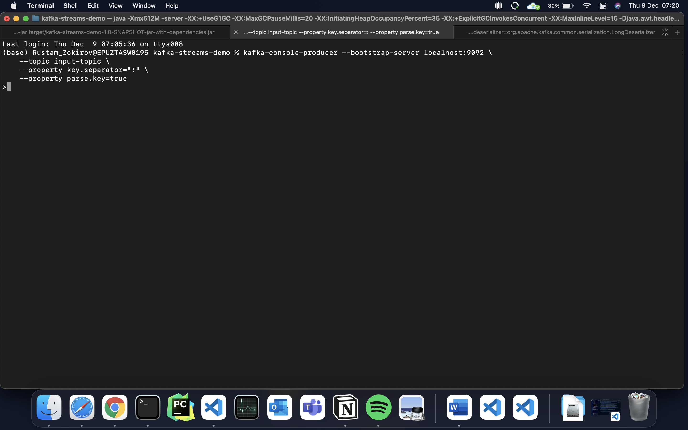
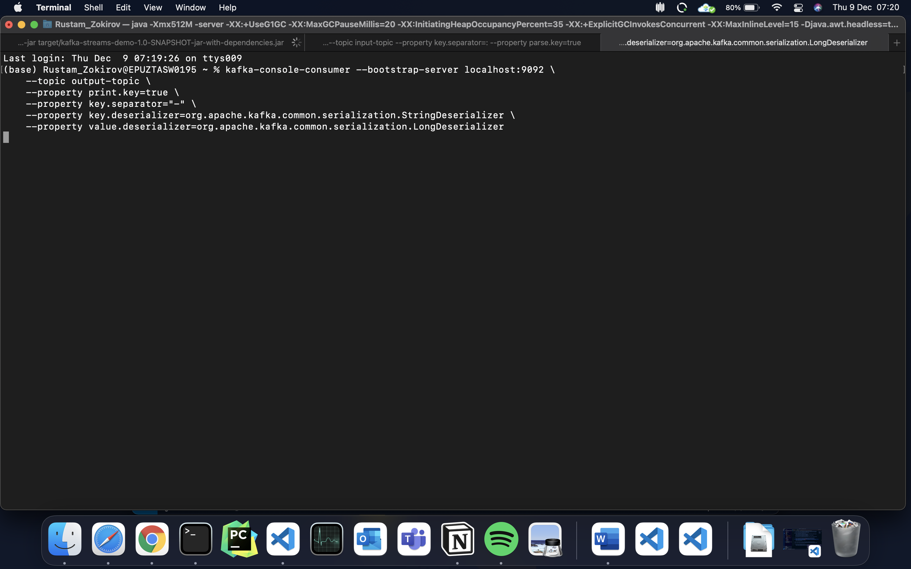
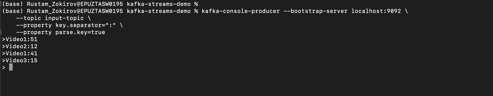
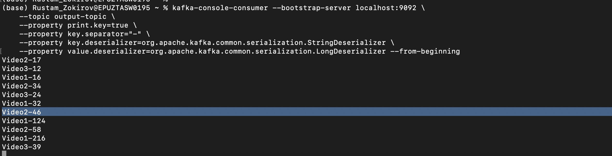

# Apache Kafka Streams Demo for Absolute Begineers

This repository shows how a simple kafka streams job can be written

# Pre-requisites

Please ensure Maven and Java 1.8 are installed in your system. Download from [here](https://maven.apache.org/download.cgi)

Also ensure you have kafka installed in your system and that kafka is up and running. If you use mac use `brew install kafka`

```
zookeeper-server-start /usr/local/etc/kafka/zookeeper.properties

kafka-server-start /usr/local/etc/kafka/server.properties
```

Now you need to create two kafka topics for input and output streams
```
kafka-topics --create --topic input-topic --bootstrap-server localhost:9092 --partitions 1 --replication-factor 1

kafka-topics --create --topic output-topic --bootstrap-server localhost:9092 --partitions 1 --replication-factor 1

kafka-topics --bootstrap-server localhost:9092 --list # List the topics you have
```

<br>

# Compiling the code

In order the compile the code and create an jar file, run the following command:
```bash
mvn clean package
```

<br>

This will create a file called **kafka-streams-demo-1.0-SNAPSHOT-jar-with-dependencies.jar** in the **target** folder

# Running the kafka streams job

You can run the jar file using the following command

```bash
java -jar target/kafka-streams-demo-1.0-SNAPSHOT-jar-with-dependencies.jar
```

<br>

Now we can create own producer to input message and consumer to read streamed message

Producer
```
kafka-console-producer --bootstrap-server localhost:9092 \
    --topic input-topic \
    --property key.separator=":" \
    --property parse.key=true 
```
<br>

Consumer
```
bin/kafka-console-consumer.sh --bootstrap-server localhost:9092 \
    --topic output-topic \
    --property print.key=true \
    --property key.separator="-" \
    --property key.deserializer=org.apache.kafka.common.serialization.StringDeserializer \
    --property value.deserializer=org.apache.kafka.common.serialization.LongDeserializer --from-beginning
```
<br>

In the Producer terminal send the following one by one!
```
Video1:5
Video2:10
Video1:4
Video1:0
Video2:7
Video3:12
Video1:7
```
<br>


In the Consumer terminal you will get the following output
```
Video2-17
Video3-12
```
<br>


## References
- https://adityasridhar.com/posts/how-to-get-started-with-maven
- https://adityasridhar.com/posts/how-to-get-started-with-kafka-streams
